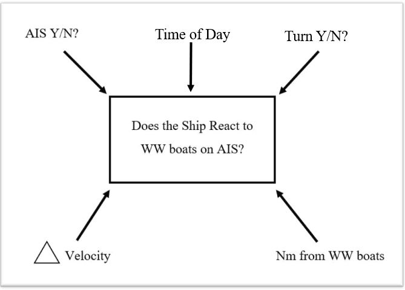

```{r setup, include=FALSE}
knitr::opts_chunk$set(echo = TRUE)
```

```{r include = FALSE}

library(dplyr)
library(ggplot2)
library(tidyr)
library(readr)
library(broom)
library(knitr)
library(patchwork)
```

#INTRODUCTION

####Ship strike is one of the leading causes of serious injury and mortality to large whales (Thomas et al. 2015). While there have been many measures to mitigate this problem, ship strikes continue (van Der Hoop et al. 2013). For example, the critically endangered North Atlantic right whales are unresponsive to ship noise and have either negative or no reactions to alerting stimuli (Nowacek et al. 2004). Nowacek et al. (2004) found that alerting stimuli from vessels cause right whales to come up to the surface more frequently, proving greater risk to getting hit by a vessel. Large ship operators have utilized marine mammal observers, but observers are limited by personnel and type of ship. 

####Automatic Identification System (AIS) is a technology that provides ship position reports with location, time, and identification information. All ocean-going commercial traffic greater than 300 tons, vessels carrying 165 or more passengers, and tugs are required to carry AIS transmitters (Federal Register 2003; IALA 2004). NOAA's Stellwagen Bank National Marine Sanctuary (SBNMS) installed 3 AIS receivers near Massachusetts Bay to monitor ship traffic transiting the SBNMS. Using this data, record of ship traffic patterns can be described, including commercial whale watch boats. AIS data have been a useful tool in the SBNMS for conservation management, effectively reducing the risk of ship strike (Wiley et al. 2013). However, as ship strike persists and exists in other areas throughout the world, and as new shifts in large whale distributions are observed (Davis et al. 2017), additional measures to protect large whales are still needed.

####The question of this study is to investigate whether large commercial ships change their traffic patterns when they detect whale watch boats via AIS in the Boston Traffic Separation Scheme (TSS). If ships deviated from their intended track due to whale watch boats detected on AIS, this essentially helps create a buffer for large whale aggregations during the whale watch season. 


#METHODS

###Model Creation

####To measure whether ships are changing their track line, deviations from their outgoing/ingoing travel path needed to be measured. Predictors that would show ship operator reactions would be: 1) Presence of AIS on whale watch boats, 2) Time of day, 3) Turning of the ship, 4) Change in velocity, and 5) Distance from whale watch boats when ship starts to turn/change velocity

####Visualization of model and predictors is show in Figure 1:

setwd("C:/Users/Laura/Dropbox/Grad school/BIOL 607 Biostats/Final Project/Figures")
getwd()




###Simulated Data

####As this was an experimental design, simulated data was produced via RStudio as seen in Figure 2. The control group, named "WW_AIS_N", consisted of days without whale watch boats reported via AIS in the TSS. The experimental group, "WW_AIS_Y", consisted of days with whale watch boats reported via AIS. Simulated data assumed a normal distribution and reflected predicted trends in the TSS. "Time of day" column, labeled "Time" assumed a random distribution and was divided into 4 groups: 8:00-10:59 (morning), 2 = 11:00-13:59 (midday), 3 = 14:00- 16:59 (afternoon), 17:00 - 19:59 (evening), as time is not predicted to have a significant effect since whale watch boats only operate during daylight hours. Change in velocity data is referred to as "Knot" in the table and this study, "Turn Y/N" was referred to as "Angle", and "Distance from whale watch boats was referred to as "Nm_from_boat".

```{r sim data}

set.seed(2018)

ship_data_rnorm_Y <- data.frame(WW_AIS = sample(c("Y"), 100, replace = TRUE),angle = (rnorm(100, 45, 10)),knots = (rnorm(100, 10, 3)),time = sample(c(1:4), 100, replace = TRUE),nm_from_boat = (rnorm(100, 15, 5)))

ship_data_rnorm_N <- data.frame(WW_AIS = sample(c("N"), 100, replace = TRUE),angle = (rnorm(100, 0, .5)),knots = (rnorm(100, 5, 1)),time = sample(c(1:4), 100, replace = TRUE),nm_from_boat = (rnorm(100, 0, 0)))

#combined data
ship_data <- rbind(ship_data_rnorm_Y, ship_data_rnorm_N)

ship_data

```
#####Figure 2 - Simulated Data set

###Statisical Testing

####A Welch's t-test was used to compare control and experimental means of each predictor. This variation of a two-sample t-test compares the means of two groups, is used when the variances of the two groups are unequal, and assumes normality of the data (Whitlock & Schluter 2015). An alpha of 0.05 was used to determine statistical significance, as it is the conventional standard, however p-values will not be as strongly supported in this study if they are in a 0.01-0.04 range under 0.05. As each predictor is assumed independent of each other via the simulated data set, multiple Welch's t-tests were tested for each predictor. An optimal sample size for means and power analyses were performed for each predictor in order to calculate minimum and maximum sample sizes needed for significant results. For power, a beta was set at 0.08, as it is the conventional power threshold (Whitlock & Schluter 2015), although when performing analysis on real-time data, a threshold goal for beta will be 1.0.

#RESULTS

###Initial visualization

####Figure 3 produces a multi-comparison of predictors to look for overall patterns. Box plots were used to compare control and experimental groups for each predictor show in Figure 4. At a visual glace, Angle, Knot, and Nm_from_boat predictors show different ranges and medians (except for Time, which was randomized). 


```{r initial visualization}
plot(ship_data)

#multi-comparisons of predictors
```
#####Figure 3 - Initial visualization for spotting trends

```{r boxplots}
knot <- ggplot(data = ship_data, aes(x = WW_AIS, y = knots)) +
  geom_boxplot() +
  ggtitle("Change in Velocity vs WW_AIS") +
  theme(plot.title = element_text(hjust = 0.5))

nm <- ggplot(data = ship_data, aes(x = WW_AIS, y = nm_from_boat)) +
  geom_boxplot() +
  ggtitle("Nm dist vs WW_AIS") +
  theme(plot.title = element_text(hjust = 0.5))

angle <- ggplot(data = ship_data, aes(x = WW_AIS, y = angle)) +
  geom_boxplot() +
  ggtitle("Angle of turn vs. WW_AIS") +
  theme(plot.title = element_text(hjust = 0.5))

time <- ggplot(data = ship_data, aes(x = WW_AIS, y = time)) +
  geom_boxplot()  +
  ggtitle("Time of day vs. WW_AIS") +
  theme(plot.title = element_text(hjust = 0.5))

knot + nm + angle + time

#Comparison of 4 predictors

```
#####Figure 4: Boxplot visualizations to compare medians and symmetry, of the 4 predictors Knot, Nm_from_boat, Angle, and Time.


###Means and Standard Deviations

####Means and SD were calculated for later power analysis shown in Figures 5 & 6. To prepare data for Welch's t-tests, data was spread by a factor of WW_AIS Y and N (see Figure 5)


```{r means}
#separated data to test the two means

ship_data_separated <- data.frame(angle_Y = (rnorm(100, 45, 10)),knots_Y = (rnorm(100, 10, 3)),time_Y = sample(c(1:4), 100, replace = TRUE),nm_from_boat_Y = (rnorm(100, 15, 5)),angle_N = (rnorm(100, 0, .5)),knots_N = (rnorm(100, 5, 1)),time_N = sample(c(1:4), 100, replace = TRUE),nm_from_boat_Y = (rnorm(100, 15, 5)),nm_from_boat_N = (rnorm(100, 0, 0)))

head(ship_data_separated)

mean_nm_Y <- mean(ship_data_separated$nm_from_boat_Y)
mean_angle_Y <- mean(ship_data_separated$angle_Y)
mean_knots_Y <- mean(ship_data_separated$knots_Y)
mean_time_Y <- mean(ship_data_separated$time_Y)

mean_nm_N <- mean(ship_data_separated$nm_from_boat_N)
mean_angle_N <- mean(ship_data_separated$angle_N)
mean_knots_N <- mean(ship_data_separated$knots_N)
mean_time_N <- mean(ship_data_separated$time_N)

aggregate(nm_from_boat ~ WW_AIS, ship_data, mean)
aggregate(knots ~ WW_AIS, ship_data, mean)
aggregate(angle ~ WW_AIS, ship_data, mean)
aggregate(time ~ WW_AIS, ship_data, mean)
```
#####Figure 5: Calculation of means. Data frame was separated into Conrol and Experimental Groups by ww_AIS "Y or N". 


```{r sd}
sd_nm_Y <- sd(ship_data_separated$nm_from_boat_Y)
sd_angle_Y <-sd(ship_data_separated$angle_Y)
sd_knots_Y <- sd(ship_data_separated$knots_Y)
sd_time_Y <- sd(ship_data_separated$time_Y)

sd_nm_N <- sd(ship_data_separated$nm_from_boat_N)
sd_angle_N <- sd(ship_data_separated$angle_N)
sd_knots_N <-sd(ship_data_separated$knots_N)
sd_time_N <- sd(ship_data_separated$time_N)

aggregate(nm_from_boat ~ WW_AIS, ship_data, sd)
aggregate(knots ~ WW_AIS, ship_data, sd)
aggregate(angle ~ WW_AIS, ship_data, sd)
aggregate(time ~ WW_AIS, ship_data, sd)
```
#####Figure 6: Calculation of standard deviations

###Welch Two-sample t-test

####All tests, except for the Time t-test, rejected the null that there was no significant difference between the control and experimental means. In Figure 7, p-value results for Angle, Knot, and Nm_from_boat were < 2.2 e-16, showing very high certainty. Time p-value = 0.4587, which accepts the null that there was no significant difference between the control and experimental means, was expected due to the structure of the simulated time data. 

```{r two sample t-tests}

#Welch two-sample t-test
t.test(ship_data_separated$nm_from_boat_Y, ship_data_separated$nm_from_boat_N)
t.test(ship_data_separated$knots_Y, ship_data_separated$knots_N)
t.test(ship_data_separated$angle_Y, ship_data_separated$angle_N)
t.test(ship_data_separated$time_Y, ship_data_separated$time_N)

tidy(t.test(ship_data_separated$nm_from_boat_Y, ship_data_separated$nm_from_boat_N))
tidy(t.test(ship_data_separated$knots_Y, ship_data_separated$knots_N))
tidy(t.test(ship_data_separated$angle_Y, ship_data_separated$angle_N))
tidy(t.test(ship_data_separated$time_Y, ship_data_separated$time_N))
```
#####Figure 7: Welch two-sample t-test results


###Testing Assumption of Welch Two Sample t-test

####To test normality of data, residuals were analyzed visually, plotted via Q-Q plots of sample vs. theoretical quantiles, and tested with the Shapiro-Wilk normality test. Figures 8-10 show normality for Angle, Knot, and Nm_from_boat predictors, as to be expected from simulated data structure. In the Shapiro-Wilk normality test, all three predictors respectively failed to reject the null hypothesis that the data are from a normal distribution, with p-values = 0.9804 (Knot), 0.06558 (Nm_from_boat), and 0.06581 (Angle). Nm_from_boat and Angle predictors hovered near an alpha of 0.05, hence the residual plots did not appear as smooth at Knot predictor. Figure 11 shows Time data was not normal (as to be expected), with the Shapiro-Wilk normality test p-value = 0.0006204. This rejects the null hypothesis that the data is normal. 

```{r test assumptions knot data}

###Knot data

#Check residuals
ship_resid_kt <- ship_data_separated %>%
  mutate(resid = ship_data_separated$knots_Y -
           ship_data_separated$knots_N)

##evaluate residuals visually
ggplot(ship_resid_kt,
       mapping = aes(x= resid)) +
  geom_density() +  #seems normal  
  ggtitle("Knot (change in velocity) residuals") +
  theme(plot.title = element_text(hjust = 0.5))

#qq plot
qqnorm(ship_resid_kt$resid)
qqline(ship_resid_kt$resid)

#put it to the test
shapiro.test(ship_resid_kt$resid)
#W = 0.99522, p-value = 0.9804
#failed to reject the null hypothesis, so it is normal
```
#####Figure 8: Testing assumptions of Welch two-sample t-test,Knot predictor data


```{r test assumptions nm data}
###Nm_from_boat data

#Check residuals
ship_resid_nm <- ship_data_separated %>%
  mutate(resid = ship_data_separated$nm_from_boat_Y -
           ship_data_separated$nm_from_boat_N) 

##evaluate residuals visually
ggplot(ship_resid_nm,
       mapping = aes(x= resid)) +
  geom_density() + #not as great   
  ggtitle("Nm from ww boat residuals") +
  theme(plot.title = element_text(hjust = 0.5))


#qq plot
qqnorm(ship_resid_nm$resid)
qqline(ship_resid_nm$resid) #tails are off

#put it to the test
shapiro.test(ship_resid_nm$resid)
#W = 0.97608, p-value = 0.06558
#failed to reject the null hypothesis, so it is normal
```
#####Figure 9: Testing assumptions of Welch two-sample t-test, Nm_from_boat data


```{r test assumptions angle data}
###Angle data

#Check residuals
ship_resid_angle <- ship_data_separated %>%
  mutate(resid = ship_data_separated$angle_Y -
           ship_data_separated$angle_N)


##evaluate residuals visually
ggplot(ship_resid_angle,
       mapping = aes(x= resid)) +
  geom_density()  + #looks pretty good
  ggtitle("Angle (turn data) residuals") +
  theme(plot.title = element_text(hjust = 0.5))


#qq plot
qqnorm(ship_resid_angle$resid)
qqline(ship_resid_angle$resid) #looks good

#put it to the test
shapiro.test(ship_resid_angle$resid)
#W = 0.98992, p-value = 0.06581
#failed to reject the null hypothesis, so it is normal
```
#####Figure 10: Testing assumptions of Welch two-sample t-test, Angle data


```{r test assumptions time data}
###Time data

#Check residuals
ship_resid_time <- ship_data_separated %>%
  mutate(resid = ship_data_separated$time_Y -
           ship_data_separated$time_N)


##evaluate residuals visually
ggplot(ship_resid_time,
       mapping = aes(x= resid)) +
  geom_density()  + #looks pretty good, weird hump
  ggtitle("Time of day residuals") +
  theme(plot.title = element_text(hjust = 0.5))


#qq plot
qqnorm(ship_resid_time$resid)
qqline(ship_resid_time$resid) #funky

#put it to the test
shapiro.test(ship_resid_time$resid)
#W = 0.94807, p-value = 0.0006204
#rejected the null hypothesis, so the data is not normal (which makes sense)

```
#####Figure 11: Testing assumptions of Welch two-sample t-test, Time data

###Maximum Sample Size needed to obtain simulated Means

####To determine optimal sample size for each predicted, simulated sample sizes were run against the mean for each predictor, as show in Figures 12-15. Optimal sample sizes ranged from 100-150 for each predictor.

```{r optimal sample size for mean Nm data}
###Nm_from_boat data

set.seed(2018)

samp_sim_nm <- data.frame(
  samp_size = rep(3:300, time = 10))  #I want a sample from 3 through 300, ten times

#take sample data frame
samp_sim_nm <- samp_sim_nm %>%
  #for each row (for each simulation)
  rowwise() %>%               #group by row and do something every row over and over again
  #draw a random normal sample with n = samp_size and take a mean
  mutate(samp_mean = mean(rnorm(samp_size, mean = mean_nm_Y, sd= sd_nm_Y)))

ggplot(data = samp_sim_nm,
       mapping = aes(x = samp_size, y = samp_mean)) +
  geom_jitter() +
  ggtitle("Optimal Nm from ww boat Sample Size") +
  theme(plot.title = element_text(hjust = 0.5))

#take simulations
samp_sim_nm_summary <- samp_sim_nm %>%
  #for each sample size
  group_by(samp_size) %>%
  #calculate the SD of sample means
  summarize(sd_mean = sd(samp_mean)) %>%
  #order by SD
  arrange(sd_mean)          

samp_sim_nm_summary

#optimal sample size is about 100 for determining significant nm from the ww boat
```
#####Figure 12: Optimal Sample size for Nm_from_boat data. Optimal sample size is about 100 for a sample mean of 15.

```{r optimal sample size for mean knot data}
###Knot data

set.seed(2018)

samp_sim_knots <- data.frame(
  samp_size = rep(3:300, time = 10))  #I want a sample from 3 through 300, ten times

#take sample data frame
samp_sim_knots <- samp_sim_knots %>%
  #for each row (for each simulation)
  rowwise() %>%               #group by row and do something every row over and over again
  #draw a random normal sample with n = samp_size and take a mean
  mutate(samp_mean = mean(rnorm(samp_size, mean = mean_knots_Y, sd= sd_knots_Y)))

ggplot(data = samp_sim_knots,
       mapping = aes(x = samp_size, y = samp_mean)) +
  geom_jitter() +
  ggtitle("Optimal Knot (change in velocity) Sample Size") +
  theme(plot.title = element_text(hjust = 0.5))

#take simulations
samp_sim_knots_summary <- samp_sim_knots %>%
  #for each sample size
  group_by(samp_size) %>%
  #calculate the SD of sample means
  summarize(sd_mean = sd(samp_mean)) %>%
  #order by SD
  arrange(sd_mean)          

samp_sim_knots_summary

#optimal sample size is about 150
```
#####Figure 13: Optimal Sample size for change in velocity predictor data. Optimal sample size is about 150 for a sample mean of 10. 

```{r optimal sample size for mean angle data}
###Angle data

set.seed(2018)

samp_sim_angle <- data.frame(
  samp_size = rep(3:300, time = 10))  #I want a sample from 3 through 300, ten times

#take sample data frame
samp_sim_angle <- samp_sim_angle %>%
  #for each row (for each simulation)
  rowwise() %>%               #group by row and do something every row over and over again
  #draw a random normal sample with n = samp_size and take a mean
  mutate(samp_mean = mean(rnorm(samp_size, mean = mean_angle_Y, sd= sd_angle_Y)))

ggplot(data = samp_sim_angle,
       mapping = aes(x = samp_size, y = samp_mean)) +
  geom_jitter() +
  ggtitle("Optimal Angle (turn data) Sample Size") +
  theme(plot.title = element_text(hjust = 0.5))

#take simulations
samp_sim_angle_summary <- samp_sim_angle %>%
  #for each sample size
  group_by(samp_size) %>%
  #calculate the SD of sample means
  summarize(sd_mean = sd(samp_mean)) %>%
  #order by SD
  arrange(sd_mean)          

samp_sim_angle_summary

#optimal sample size is about 100
```
#####Figure 14: Optimal Sample size for Angle predictor data. Optimal sample size is about 100 for a sample mean of 45.

```{r optimal sample size for mean Time data}
###Angle data

set.seed(2018)

samp_sim_time <- data.frame(
  samp_size = rep(3:300, time = 10))  #I want a sample from 3 through 300, ten times


#take sample data frame
samp_sim_time <- samp_sim_time %>%
  #for each row (for each simulation)
  rowwise() %>%               #group by row and do something every row over and over again
  #draw a random normal sample with n = samp_size and take a mean
  mutate(samp_mean = mean(rnorm(samp_size, mean = mean_time_Y, sd= sd_time_Y)))

ggplot(data = samp_sim_time,
       mapping = aes(x = samp_size, y = samp_mean)) +
  geom_jitter() +
  ggtitle("Optimal Time of Day Sample Size") +
  theme(plot.title = element_text(hjust = 0.5))

#take simulations
samp_sim_time_summary <- samp_sim_time %>%
  #for each sample size
  group_by(samp_size) %>%
  #calculate the SD of sample means
  summarize(sd_mean = sd(samp_mean)) %>%
  #order by SD
  arrange(sd_mean)          

samp_sim_time_summary

#optimal sample size is about 150
```
#####Figure 15: Optimal Sample size for Time predictor data. Optimal size is about 150 for a sample mean of 2.5.

###Power Analyses

####Power analyses of the Welch two-sample t-tests were conducted in order to determine the minimal sample size needed to have low probability of a Type II error, or high power. The power threshold for this study was 0.80, as it is the conventional power threshold (Whitlock & Schluter 2015). Power analyses were performed on each predictor. Each analysis looked at how sample size effected power, by a factor of different standard deviations. Figure 16 results show that Nm_from_boat predictor would need a minimum sample size of 7 to obtain a power threshold of 0.80 (allowing a SD range of up to 8). Figure 17 results show that Knot predictor would need a minimum sample size of 43 to obtain a power threshold of 0.80 (allowing a SD range of up to 8). This higher needed sample size makes sense, as there was more simulated variation in this data. Figure 18 results show that Angle predictor would need a minimum sample size of 3 to obtain a power threshold of 0.80 (allowing a SD range of up to 8). Little variation was simulated in this predictor; hence a small sample size was expected. Lastly, in Figure 19, Time predictor will not obtain enough power, as there was no simulated difference between the control and experimental means. 


```{r Power nm}
set.seed(2018)
###Nm_from_boat power

#simulate t data
#make a function data frame, that can repeat n amount of times
#use a normal distribution rnorm

make_t_data <- function(m1, m2, s, n){
  #make a data frame, repeating treatments n number of times
  #and use rnorm to get values
  data.frame(treatment = c(rep("A", n), rep("B", n)),
             value = rnorm(n*2, mean = c(rep(m1,n), rep(m2, n)), s))
}

#test if the fuction works
make_t_data(m1 = mean_nm_Y, m2 = mean_nm_N, s = sd_nm_Y, n = 100)

#the output of any t.test is a list with an entry called p.value
#so need to extract just a p-value

#extraction function:
get_p_from_t_test <- function(sim_data){
  #run the t test on the data
  test <- t.test(value ~ treatment, data = sim_data)
  test$p.value
}

#testing out extracton function:
get_p_from_t_test(make_t_data(m1 = mean_nm_Y, m2 = mean_nm_N, s = sd_nm_Y, n = 100))
#I get a small P value with big sample size
get_p_from_t_test(make_t_data(m1 = mean_nm_Y, m2 = mean_nm_N, s = sd_nm_Y, n = 3))
#I get a large P value the smaller the sample size I choose

#now I need to simulate p values many times
replicate(10,
          get_p_from_t_test(make_t_data(m1 = mean_nm_Y, m2 = mean_nm_N, s = sd_nm_Y, n = 100)))

#10 P values created

#Now I need some number of simulations, and a set alpha (I will do .05)
get_t_power <- function(m1, m2, s, n, nsims = 100, alpha = 0.05){
  #a vector of p values
  p <- replicate(nsims,
                 get_p_from_t_test(make_t_data(m1, m2, s, n)))
  #calculate the number of p values that are incorrect given that we should be rejecting the null
  num_wrong <- sum(p > alpha)
  #return power
  1 - num_wrong/nsims
}

#test this function

#nm_from_boat Power
get_t_power(m1 = mean_nm_Y, m2 = mean_nm_N, s = sd_nm_Y, n = 100, nsims = 100, alpha=0.05)
#higher power with bigger sample size
get_t_power(m1 = mean_nm_Y, m2 = mean_nm_N, s = sd_nm_Y, n = 3, nsims = 100, alpha=0.05)
#lower power with smaller sample size, does not reach 0.8

#get power from simulations
nm_power <- crossing(m1 = mean_nm_Y, m2 = mean_nm_N, s = 1:8, n = 2:20) %>%
  rowwise() %>%
  mutate(power = get_t_power(m1, m2, s, n, nsim = 100)) %>%
  ungroup()

ggplot(nm_power,
       mapping = aes(x = n, y = power, color = factor(s))) +
  geom_point() +
  geom_line() +
  theme_bw() +
  geom_hline(yintercept = 0.8, lty =2) +
  ggtitle("Nm_from_ww_boat Power Analysis") +
  theme(plot.title = element_text(hjust = 0.5)) + 
  labs(colour = "Factor (SD)") 

#this shows that sample sizes of at least 7 will have enough power for nm_from_boat data, (with a SD ranging from 1:8)
```
#####Figure 16: Power analysis of Nm_from_boat data.This shows that sample size of at least 7 will have enough power to reach the threshold of 0.8, with SD's ranging from 1:8.


```{r Power knot}
###Knot Power

#testing out extracton function:
get_p_from_t_test(make_t_data(m1 = mean_knots_Y, m2 = mean_knots_N, s = sd_knots_Y, n = 100))
#I get a small P value with big sample size
get_p_from_t_test(make_t_data(m1 = mean_knots_Y, m2 = mean_knots_N, s = sd_knots_Y, n = 3))
#I get a large P value the smaller the sample size I choose

#test the power function

#knot Power
get_t_power(m1 = mean_knots_Y, m2 = mean_knots_N, s = sd_knots_Y, n = 100, nsims = 100, alpha=0.05)
#higher power with bigger sample size
get_t_power(m1 = mean_knots_Y, m2 = mean_knots_N, s = sd_knots_Y, n = 3, nsims = 100, alpha=0.05)
#lower power with smaller sample size, does not reach 0.8

#get power from simulations
knot_power <- crossing(m1 = mean_knots_Y, m2 = mean_knots_N, s = 1:8, n = 2:50) %>%
  rowwise() %>%
  mutate(power = get_t_power(m1, m2, s, n, nsim = 100)) %>%
  ungroup()

ggplot(knot_power,
       mapping = aes(x = n, y = power, color = factor(s))) +
  geom_point() +
  geom_line() +
  theme_bw() +
  geom_hline(yintercept = 0.8, lty =2) +
  ggtitle("Knot Power Analysis") +
  theme(plot.title = element_text(hjust = 0.5)) + 
  labs(colour = "Factor (SD)") 

#this shows that sample size of at least 43 to have enough power for knot_data(with a SD ranging from 1:8)
```
#####Figure 17: Power analysis of Knot data. This shows that sample size of at least 43 will have enough power to reach the threshold of 0.8, with SD's ranging from 1:8.

```{r Power angle}
###Angle Power

#testing out extracton function:
get_p_from_t_test(make_t_data(m1 = mean_angle_Y, m2 = mean_angle_N, s = sd_angle_Y, n = 100))
#I get a small P value with big sample size
get_p_from_t_test(make_t_data(m1 = mean_angle_Y, m2 = mean_angle_N, s = sd_angle_Y, n = 3))
#I get a large P value the smaller the sample size I choose

#test the power function

#angle Power
get_t_power(m1 = mean_angle_Y, m2 = mean_angle_N, s = sd_angle_Y, n = 100, nsims = 100, alpha=0.05)
#higher power with bigger sample size
get_t_power(m1 = mean_angle_Y, m2 = mean_angle_N, s = sd_angle_Y, n = 3, nsims = 100, alpha=0.05)
#lower power with smaller sample size, just over 0.8

#get power from simulations
angle_power <- crossing(m1 = mean_angle_Y, m2 = mean_angle_N, s = 1:8, n = 2:8) %>%
  rowwise() %>%
  mutate(power = get_t_power(m1, m2, s, n, nsim = 100)) %>%
  ungroup()

ggplot(angle_power,
       mapping = aes(x = n, y = power, color = factor(s))) +
  geom_point() +
  geom_line() +
  theme_bw() +
  geom_hline(yintercept = 0.8, lty =2) +
  ggtitle("Angle Power Analysis") +
  theme(plot.title = element_text(hjust = 0.5)) + 
  labs(colour = "Factor (SD)") 

#this shows that sample size of at least 3 would have enough power for angle data - because the mean_angle_N is basically 0. 
```
#####Figure 18: Power analysis of Angle data. This shows that sample size of at least 3 will have enough power to reach the threshold of 0.8, with SD's ranging from 1:8.

```{r Power time}
###Time Power

#testing out extracton function:
get_p_from_t_test(make_t_data(m1 = mean_time_Y, m2 = mean_time_N, s = sd_time_Y, n = 100))
#no significant p value (as expected)
get_p_from_t_test(make_t_data(m1 = mean_time_Y, m2 = mean_time_N, s = sd_time_Y, n = 3))
#no significant p value (as expected)

#test the power function

get_t_power(m1 = mean_time_Y, m2 = mean_time_N, s = sd_time_Y, n = 100, nsims = 100, alpha=0.05)
#higher power with bigger sample size
get_t_power(m1 = mean_time_Y, m2 = mean_time_N, s = sd_time_Y, n = 3, nsims = 100, alpha=0.05)
#lower power with smaller sample size, just over 0.8

#get power from simulations
time_power <- crossing(m1 = mean_time_Y, m2 = mean_time_N, s = 1:8, n = 2:50) %>%
  rowwise() %>%
  mutate(power = get_t_power(m1, m2, s, n, nsim = 100)) %>%
  ungroup()

ggplot(time_power,
       mapping = aes(x = n, y = power, color = factor(s))) +
  geom_point() +
  geom_line() +
  theme_bw() +
  geom_hline(yintercept = 0.8, lty =2) +
  ggtitle("Time Power Analysis") +
  theme(plot.title = element_text(hjust = 0.5)) + 
  labs(colour = "Factor (SD)") 

#since there is no simulated difference between the time means, not being able to reach a power threshold is expected
```
#####Figure 19: Power analysis of Time data. As there is no significant difference between the two means, the power threshold of 0.8 will not be able to be met. 

#DISCUSSION

####According to the power analyses, significant results of the Welch two-sample t-tests can be achieved with relatively small sample sizes, assuming that real-time data follows trends that were simulated. Real-time AIS data will be processed for this study for future analysis. When real-time AIS data are obtained, I will most likely have uneven sample sizes, so statistical testing will need to account for that (a Welch two-sample t-test accounts for unequal variances, so would still be appropriate). Normality of the real-time data will also need to be investigated and tested, in order to meet assumptions for the Welch two-sample t-test. If the normal distribution assumption of the real-time data cannot be met, a Mann-Whitney U-test would be used in its place, as it can be used to compare two means with non-normal distribution (Whitlock & Schluter 2015).

####When analyzing real-time AIS data, the predictors will need to be tested to see if they are actually independent of each other. Plots comparing predictors can be used as they were in the initial visualizations shown in Figure 3. If all or some predictors appear dependent of each other, ANOVA statistical tests could be used to investigate potential covariance. 

####Finally, to do determine a true "control" group, I will need to see if there are other reasons that ships might deviate from their track other than if whale watch boats via AIS. When whale watch boats are not shown to be present on AIS, I will sub-sample some control days to see how often tracks deviate from their track and/or change velocity. To further confirm a true "control", I will use my multi-year whale watch database with Boston Harbor Cruises to additionally confirm whether whale watch boats were present (and not reporting location via AIS). Using this data, I can see if ships also deviate tracks when non-AIS reporting whale watch boats are present. 


#REFERENCES

####Davis, G.E., Baumgartner, M.F., Bonnell, J.M., Bell, J., Berchok, C., Thornton, J.B., Brault, S.,Buchanan, G., Charif, R.A., Cholewiak, D. and Clark, C.W., 2017. Long-term passive acoustic recordings track the changing distribution of North Atlantic right whales (Eubalaena glacialis) from 2004 to 2014. Scientific Reports, 7(1), p.13460.

####Federal Register (2003) Automatic Identification System; vessel carriage requirement. Coast Guard, U.S. Department of Homeland Security, 60559-60570. October 22. 

####International Association of Marine Aids to Navigation and Lighthouse Authorities (IALA) (2004) IALA Guideline No. 1028 on the Automatic Identification System (AIS): Part I. Operational issues. 1. Saint Germain en Laye, France. 

####Nowacek, D.P., M.P. Johnson, and P.L. Tyack. 2004. North Atlantic right whales (Eubalaena glacialis) ignore ships but respond to alerting stimuli. Proceedings of the Royal Society of London B: Biological Sciences 271:227-231.

####Thomas, P.O., R.R. Reeves, and R.L. Brownell. 2016. Status of the world's baleen whales. Marine Mammal Science 32:682-734.

####Van Der Hoop, J.M., M.J. Moore, S.G. Barco, T.V. Cole, P.Y. Daoust, A.G. Henry, D.F. McAlpine, W.A. McLellan, T. Wimmer, and A.R. Solow. 2013. Assessment of management to mitigate anthropogenic effects on large whales. Conservation Biology 27:121-133.

####Whitlock, M & D. Schluter. 2015. Roberts and Company Publishers. Greenwood Village, CO.

####Wiley, D.N, L. Hatch, M. Thompson, K. Schwehr, and C. MacDonald. 2013. Marine Sanctuaries and Marine Planning: Protecting endangered marine life. National Ocean Policy. Proceedings Fall 2013:10-15. www.uscg.mil/proceedings 


